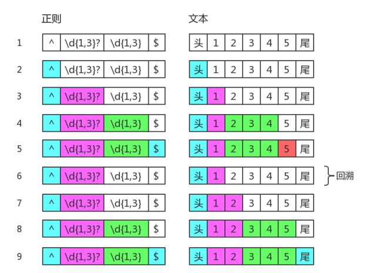

# 正则表达式攻略

## 1.字符匹配攻略

> 正则表达式是匹配模式，要么匹配字符，要么匹配位置

### 1.1 两种模糊匹配

#### 1.1.1 横向模糊匹配

横向模糊指的是，一个正则可匹配的字符串的长度不是固定的，可以是多种情况的

譬如 `{m,n}` 表示连续出现最少 m 次，最多 n 次

```javascript
const reg = /ab{2,5}c/g;

const string = 'abc abbc abbbc abbbbc abbbbbc abbbbbbc';

console.log(string.match(reg));
```

> g 是正则的一个修饰符，表示全局匹配
>
> 意为在目标字符串中按顺序找到满足匹配模式的所有子串，强调的是【所有】，而不只是【第一个】

#### 1.1.2 纵向模糊匹配

纵向模糊指的是，一个正则匹配的字符串，具体到某一位字符时，可以不是某个确定的字符，可以有多种可能

譬如 `[abc]` 表示该字符可以是 a、b、c 中的任何一个

```javascript
const reg = /a[123]b/g;

const string = 'a0b a1b a2b a3b a4b';

console.log(string.match(reg));
```

### 1.2 字符组

#### 1.2.1 范围表示法

譬如 `[123456abcdefGHIJKLM]` 可以写成 `[1-6a-fG-M]`

如果要匹配 `-` 字符时就不能写成 `[a-z]` 了，因为其表示小写字母中的任何一个字符了

可以写成 `[-az]` 或 `[az-]` 或 `[a\-z]`，要么放在开头，要么放在结尾，要么转义

#### 1.2.2 排除字符组

纵向模糊匹配，有一种情景，某位字符可以是任何东西，就是不能是 a、b、c，此时就是排除字符组的概念

譬如 `[^abc]` 表示是一个除 a、b、c 之外的任意一个字符，`^` 表示求反

#### 1.2.3 常见的简写形式

| 字符组 | 具体含义                                                     |
| ------ | ------------------------------------------------------------ |
| `\d`   | 表示`[0-9]`，表示是一位数字                                  |
| `\D`   | 表示`[^0-9]`，表示除数字外的任意一位字符                     |
| `\w`   | 表示`[0-9a-zA-z_]`，表示数字、大小写字母和下划线             |
| `\W`   | 表示`[^0-9a-zA-Z_]`，表示非数字、大小写字母和下划线的任意一位字符 |
| `\s`   | 表示`[\t\v\n\r\f]`，表示空白符，包括空格、水平制表符、垂直制表符、换行符、回车符、换页符 |
| `\S`   | 表示`[^\t\v\n\r\f]`，非空白符                                |
| `.`    | 表示`[^\n\r\u2028\u2029]`，通配符，表示几乎任意字符，换行符、回车符、行分隔符和段分隔符除外 |

> 如果要匹配任意字符，可以使用 `[\d\D]`、`[\w\W]`、`[\s\S]`、`[^]` 中任一个

### 1.3 量词【重复】

#### 1.3.1 简写形式

| 量词   | 具体含义                                   |
| ------ | ------------------------------------------ |
| `{m,}` | 表示至少出现 m 次                          |
| `{m}`  | 等价于`{m,m}`，表示出现 m 次               |
| `?`    | 等价于`{0,1}`，表示出现一次或不出现        |
| `+`    | 等价于`{1,}`，表示出现至少一次             |
| `*`    | 等价于`{0,}`，表示出现任意次，有可能不出现 |

#### 1.3.2 贪婪匹配与惰性匹配

```javascript
const reg = /\d{2,5}/g;

const string = '123 1234 12345 123456';

console.log(string.match(reg));
```

上述例子中，`/\d{2,5}/g` 表示数字连续出现了 2 到 5 次，会匹配 2、3、4、5 位连续数字

但是其是贪婪的，它会尽可能多的匹配，6 位连续数字它会匹配 5 位，3 位连续数字它会匹配 3 位，反正只要在能力范围内，越多越好

```javascript
const reg = /\d{2,5}?/g;

const string = '123 1234 12345 123456';

console.log(string.match(reg));
```

上述例子中，`/\d{2,5}?/g` 表示虽然 2 到 5 位连续数字都行，但是当匹配到 2 位连续数字后，就不再往下尝试了

通过在量词后加个问号就能实现惰性匹配：

| 惰性量词 | 贪婪量词 |
| -------- | -------- |
| `{m,n}?` | `{m,n}`  |
| `{m,}?`  | `{m,}`   |
| `??`     | `?`      |
| `+?`     | `+`      |
| `*?`     | `*`      |

### 1.4 多选分支

一个模式可以实现横向和纵向模糊匹配，而多选分支可以支持多个子模式任选其一

具体形式：`(p1|p2|p3)` 中 p1、p2、p3 是子模式，用 `|` 管道符分隔，表示其中任一

```javascript
const reg = /good|nice/g;

const string = 'good idea, nice try.';

console.log(string.match(reg));
```

但需要注意，用 `/good|goodbye/` 去匹配 `goodbye` 字符串时，结果是 `good`

而用 `/goodbye|good/` 去匹配 `goodbye` 字符串时，结果是 `goodbye`

也就是说，分支结构是惰性的，当有一个模式匹配上了，后面的模式就不再尝试了

### 1.5 案例分析

#### 1.5.1 匹配 16 进制颜色值

```javascript
const reg = /#[0-9a-zA-Z]{6}|#[0-9a-zA-Z]{3}/g;

const string = '#ffbbad #Fc01DF #FFF #ffE';

console.log(string.match(reg));
```

#### 1.5.2 匹配时间

```javascript
const reg = /^([01][0-9]|[2][0-3]):[0-5][0-9]$/;

console.log(reg.test('23:59'));
console.log(reg.test('02:07'));
```

#### 1.5.3 匹配日期

```javascript
const reg = /^[0-9]{4}-([0][1-9]|[1][0-2])-([0][1-9]|[12][0-9])|[3][0-1]$/;

console.log(reg.test('2024-04-28'));
```

#### 1.5.4 匹配 Windows 操作系统文件路径

```javascript
const reg = /^[a-zA-Z]:\\([^\\:*<>|"?\r\n/]+\\)*([^\\:*<>|"?\r\n/]+)$/;

console.log(reg.test(process.cwd()));
```

#### 1.5.5 匹配 id

```javascript
// const reg = /id=".*?"/;
const reg = /id="[^"]*"/;

const string = '<div id="container" class="main"></div>';

console.log(string.match(reg));
```

## 2. 位置匹配攻略

### 2.1 什么是位置

位置【锚】是相邻字符之间的位置


### 2.2 如何匹配位置

在 ES5 中，共有 6 个锚：

- `^`
- `$`
- `\b`
- `\B`
- `(?=p)`
- `(?!p)`

#### 2.2.1 `^` 和 `$`

- `^` 匹配开头，在多行匹配中匹配行开头
- `$` 匹配结尾，在多行匹配中匹配行结尾

```javascript
const string = 'hello';

const reg = /^|$/g;

console.log(string.replace(reg, '#'));
```

上述例子中，用 `#` 替换开头和结尾【位置可以替换成字符】

```javascript
const string = 'I\nlove\njavascript';

const reg = /^|$/gm;

console.log(string.replace(reg, '#'));
```

上述例子中，使用 `m` 修饰符开启多行匹配模式，这时候 `^` 和 `$` 表示行开头和行结尾

> 需要注意，在大多数正则匹配引擎中，`\r` 和 `\n` 都会被认定开启了新行
>
> 额外，JavaScript 中模板字符串中换行符锁定为 `\n`，不管在什么操作系统中

#### 2.2.2 `\b` 和 `\B`

`\b` 是单词边界，具体就是 `\w` 和 `\W` 之间的位置，也包括 `\w` 和 `^` 之间的位置和 `\w` 和 `$` 	之间的位置

```javascript
const string = '[JS] Lesson_01.mp4';

const reg = /\b/g;

console.log(string.replace(reg, '#'));
```

`\B` 就是 `\b` 反面的意思，非单词边界，在字符串所有位置中，扣掉 `\b` 的位置，剩下的位置都是 `\B` 的

具体来说，就是 `\w` 和 `\w`、`\W` 和 `\W`、`\W` 和 `^`、`\W` 和 `$` 之间的位置

```javascript
const string = '[JS] Lesson_01.mp4';

const reg = /\B/g;

console.log(string.replace(reg, '#'));
```

#### 2.2.3 `(?=p)` 和 `(?!p)`

`(?=p)`，其中 `p` 是一个子模式，即 `p` 之前的位置

譬如，`(?=l)` 表示 `l` 字符之前的位置：

```javascript
const string = 'hello';

const reg = /(?=l)/g;

console.log(string.replace(reg, '#'));
```

而 `(?!p)` 就是 `(?=p)` 的反面意思，字符串所有位置中，扣掉 `(?=p)` 的位置，剩下的位置都是 `(?!p)` 的

```javascript
const string = 'hello';

const reg = /(?!l)/g;

console.log(string.replace(reg, '#'));
```

> 两者学名分别是 `positive lookahead` 和 `negative lookahead`
>
> 也就是正向先行断言和负向先行断言
>
> ES6+ 版本中，支持 `positive lookbehind` 和 `negative lookbehind`
>
> 具体是 `(?<=p)` 和 `(?<!p)`
>
> 也就是匹配 `p` 之后的位置和匹配除 `p` 之后的位置以外的所有位置

### 2.3 位置的特性

对于位置的理解，可以理解成空字符

譬如，`hello` 字符串等价于以下形式：

```javascript
console.log('hello' === '' + 'h' + '' + 'e' + '' + 'l' + '' + 'l' + '' + 'o' + '');
console.log('hello' === '' + '' + 'hello' + '' + '' + '');
```

因此，将 `/^hello$/` 写成 `/^^hello$$$/` 没有任何问题，甚至更复杂的也可以：

```javascript
console.log(/^^hello$$$/.test('hello'));
console.log(/(?=he)^^he(?=\w)llo$\b\b$/.test('hello'));
```

### 2.4 案例分析

#### 2.4.1 不匹配任何东西的正则

```javascript
const string = 'hello';

// const reg = /.^/;
const reg = /$./;

console.log(string.match(reg));
```

#### 2.4.2 数字的千位分隔符表示法

```javascript
const string = '123456789';

const reg = /(?!^)(?=(\d{3})+$)/g;

console.log(string.replace(reg, ','));
```

#### 2.4.3 验证密码问题

要求密码长度 6 到 12 位，由数字、小写字母、大写字母组成，但必须至少包括两种字符

两种思路：

1. 数字和小写字母、数字和大写字母、小写字母和大写字母
2. 不能全是数字、不能全是小写字母、不能全是大写字母

```javascript
// const reg = /((?=.*[0-9])(?=.*[a-z])|(?=.*[0-9])(?=.*[A-Z])|(?=.*[a-z])(?=.*[A-Z]))^[0-9a-zA-Z]{6,12}$/;
const reg = /(?!^[0-9]{6,12}$)(?!^[a-z]{6,12}$)(?!^[A-Z]{6,12}$)^[0-9a-zA-Z]{6,12}$/;

const string = '1qazXSW2';

console.log(string.match(reg));
```

## 3. 括号的作用

### 3.1 分组和分支结构

#### 3.1.1 分组

```javascript
const reg = /(ab)+/g;

const string = 'ababa abbb ababab';

console.log(string.match(reg));
```

#### 3.1.2 分支结构

```javascript
const reg = /^I love (JavaScript|Regular Expression)$/;

console.log(reg.test('I love JavaScript'));
console.log(reg.test('I love Regular Expression'));
```

### 3.2 分组引用

> 这是括号一个重要的作用，有了它，就可以进行数据提取，以及更强大的替换操作

#### 3.2.1 提取数据

```javascript
const reg = /^(\d{4})-(\d{2})-(\d{2})$/;

const string = '2024-04-29';

console.log(string.match(reg));
```

> `match` 执行返回一个数组，第一个元素是整体匹配结果，然后是各个分组【括号里】匹配的内容，然后是匹配下标，最后是输入的文本
>
> 另外，正则表达式是否有 `g` 修饰符，`match` 返回的数组格式是不一样的

另外也可以使用正则实例对象的 `exec` 方法：

```javascript
const reg = /^(\d{4})-(\d{2})-(\d{2})$/;

const string = '2024-04-29';

console.log(reg.exec(string));
```

还可以使用构造函数的全局属性 `$1` 至 `$9` 来获取：

```javascript
const reg = /^(\d{4})-(\d{2})-(\d{2})$/;

const string = '2024-04-29';

reg.test(string);
// reg.exec(string);
// string.match(reg);

console.log(RegExp.$1);
console.log(RegExp.$2);
console.log(RegExp.$3);
```

> 不推荐，该特性已弃用

#### 3.2.2 替换

```javascript
const reg = /^(\d{4})-(\d{2})-(\d{2})$/;

const string = '2024-04-29';

string.replace(reg, function () {
  console.log(arguments);
});

console.log(string.replace(reg, '$2/$3/$1'));
```

### 3.3 反向引用

除了使用相应 API 来引用分组，也可以在正则本身里引用分组，但只能引用之前出现的分组，即反向引用

```javascript
const reg = /^\d{4}(-|\/|\.)\d{2}(-|\/|\.)\d{2}$/;

console.log(reg.test('2024-04-29'));
console.log(reg.test('2024/04/29'));
console.log(reg.test('2024.04.29'));
console.log(reg.test('2024-04/29'));
```

> 上述例子中，虽然匹配了要求的情况，但是也匹配了 `2024-04/29` 这样的错误数据

```javascript
const reg = /^\d{4}(-|\/|\.)\d{2}\1\d{2}$/;

console.log(reg.test('2024-04-29'));
console.log(reg.test('2024/04/29'));
console.log(reg.test('2024.04.29'));
console.log(reg.test('2024-04/29'));
```

> 上述例子中，通过 `\1` 引用了之前的分组，不管它匹配到了什么，都匹配那个同样的具体某个字符

#### 3.3.1 括号嵌套怎么办

```javascript
const reg = /^((\d)(\d(\d)))\1\2\3\4$/;

const string = '1231231233';

console.log(reg.test(string)); // true
console.log(RegExp.$1); // 123
console.log(RegExp.$2); // 1
console.log(RegExp.$3); // 23
console.log(RegExp.$4); // 3
```

#### 3.3.2 `\10` 表示什么

`\10` 表示第十个分组

```javascript
const reg = /^(1)(2)(3)(4)(5)(6)(7)(8)(9)(#) \10+$/;

const string = '123456789# #######';

console.log(string.match(reg));
```

> 如果要匹配 `\1` 和 `0` 的话，请使用 `(?:\1)0` 或 `\1(?:0)`

#### 3.3.3 引用不存在的分组会怎样

因为反向引用，是引用之前的分组

但在正则中引用了不存在的分组时，此时正则不会报错，只是匹配反向引用的字符本身

譬如 `\2`，就匹配 `\2`【注意，`\2` 表示对 `2` 进行了转义】

```javascript
const reg = /^\1\2\3\4\5\6\7$/;

const string = '\1\2\3\4\5\6\7';

console.log(string.split(''));

console.log(reg.test(string));
```

#### 3.3.4 分组之后有量词会怎样

分组之后有量词的话，分组最终捕获到的数据是最后一次的匹配

```javascript
const reg = /^(\d)+$/;

const string = '12345';

console.log(string.match(reg));
```

```javascript
const reg = /^(\d)+ \1$/;

const string = '12345 5';

console.log(string.match(reg));
```

### 3.4 非捕获括号

之前出现的括号，都会捕获它们匹配到的数据，以便后续引用，因此也称它们为捕获型分组和捕获型分支

如果只想要括号最原始的功能，但不会引用它，即，既不在 API 中引用，也不会在正则里反向引用

此时，可以使用非捕获括号 `(?:p)` 和 `(?:p1|p2|p3)`：

```javascript
const reg = /(?:ab)+/g;

const string = 'ababa abbb ababab';

console.log(string.match(reg));
```

```javascript
const reg = /^I love (?:JavaScript|Regular Expression)$/;

console.log(reg.test('I love JavaScript'));
console.log(reg.test('I love Regular Expression'));
```

### 3.5 案例分析

#### 3.5.1 模拟字符串 trim 方法

`trim` 方法是去掉字符串开头和结尾的空白符，有两种思路实现：

- 匹配到开头和结尾的空白符，然后替换成空字符
- 匹配整个字符串，然后用引用来提取出相应的数据

```javascript
function trim(str) {
  return str.replace(/^\s+|\s+$/g, '');
}

console.log(trim('   abc   '));
```

```javascript
function trim(str) {
  return str.replace(/^\s*(.*?)\s*$/, '$1');
}

console.log(trim('   abc  '));
```

#### 3.5.2 将每个单词的首字母转化为大写

```javascript
function titleCase(str) {
  return str.toLowerCase().replace(/(?:^|\s+)\w/g, function (c) {
    return c.toUpperCase();
  });
}

console.log(titleCase('my name is jerry'));
```

#### 3.5.3 驼峰化

```javascript
function PascalCase(str) {
  return str.replace(/[-_\s]+(.?)/g, function (match, c) {
    return c ? c.toUpperCase() : '';
  });
}

console.log(PascalCase('-moz-transform '));
```

#### 3.5.4 中划线化

```javascript
function strike(str) {
  return str
    .replace(/([A-Z])/g, '-$1')
    .replace(/[-_\s]+/g, '-')
    .toLowerCase();
}

console.log(strike('MozTransform'));
```

#### 3.5.5 HTML 转义和反转义

```javascript
function escape(str) {
  const chars = {
    '<': 'lt',
    '>': 'gt',
    '"': 'quot',
    '&': 'amp',
    "'": 'apos',
    ' ': 'nbsp'
  };
  return str.replace(new RegExp(`[${Object.keys(chars).join('')}]`, 'g'), function (match) {
    return `&${chars[match]};`;
  });
}

console.log(escape("<div class='container'>this is container</div>"));

function unescape(str) {
  const chars = {
    lt: '<',
    gt: '>',
    quot: '"',
    amp: '&',
    apos: "'",
    nbsp: ' '
  };
  return str.replace(/&([^;]+);/g, function (match, key) {
    if (key in chars) return chars[key];
    return match;
  });
}

console.log(unescape(escape("<div class='container'>this is container</div>")));
```

#### 3.5.6 匹配成对标签

```javascript
const reg = /<([^>]+)>[^]*<\/\1>/g;

const str1 = '<p>this is p</p>';
const str2 = '<p>this is p</p><div>this is div</div>';
const str3 = `<p>this is p</p>
<div>this is div</div>`;

console.log(str1.match(reg));

console.log(str2.match(reg));

console.log(str3.match(reg));
```

## 4 回溯法原理

### 4.1 没有回溯的匹配

假设正则是 `/ab{1,3}c/`，当目标字符串是 `abbbc` 时，就没有所谓的回溯，其匹配过程如下：


### 4.2 有回溯的匹配

如果目标字符串是 `abbc` 时，匹配过程中就有回溯：


再举个例子，正则是 `/ab{1,3}bbc/`，目标字符串是 `abbbc`，匹配过程如下：


再举个例子，正则是 `/".*"/`，目标字符串是 `"abc"de`，匹配过程如下：


> 可以看出 `.*` 非常影响效率，为了减少不必要的回溯，可以修改正则为 `/"[^"]*"/`

### 4.3 常见的回溯形式

正则表达式匹配字符串的这种方式，叫做回溯法

回溯法也称试探法，基本思想：从问题的某一状态【初始状态】出发，搜索从该状态出发所能达到的最深路径，当一条路走到尽头时，再后退一步或若干步，从另一种可能状态出发，继续搜索，直到所有路径都试探过

这种不断前进，不断回溯寻找解的方法，就叫做回溯法

本质上就是深度优先搜索算法，其中退到之前某一步的过程，就叫做回溯

从之前匹配过程中可以看出，当路走不通时，就会发生回溯，即尝试匹配失败时，接下来的一步通常就是回溯

#### 4.3.1 贪婪量词

贪婪量词，尝试可能的顺序是从多往少的方向去尝试

譬如，`b{1,3}` 首先会尝试 `bbb`，然后再看整个正则是否能匹配，不能匹配时，吐出一个 `b`，在 `bb` 的基础上再继续尝试，如果还不行，再吐出一个，再尝试，如果还不行，只能说匹配失败了

当多个贪婪量词挨着存在，并互相有冲突时，靠前的贪婪量词先下手为强：

```javascript
const reg = /^(\d{1,3})(\d{1,3})$/;

const string = '12345';

console.log(string.match(reg));
```

> 前面的 `\d{1,3}` 匹配 `123`，后面的 `\d{1,3}` 匹配 `45`

#### 4.3.2 惰性量词

惰性量词就是在贪婪量词后面加个问号，表示尽可能少的匹配

```javascript
const reg = /^(\d{1,3}?)(\d{1,3}?)$/;

const string = '12345';

console.log(string.match(reg));
```

> 前面的 `\d{1,3}?` 匹配 `12`，后面的 `\d{1,3}?` 无可奈何，只能匹配 `345`

虽然惰性量词不贪，但也会有回溯的现象：



#### 4.3.3 分支结构

分支结构也是惰性的

譬如，`/can|candy/` 去匹配 `candy`，得到结果 `can`

因为分支结构会一个一个去尝试，如果前面的满足了，就不会向后尝试了

分支结构，可能前面的子模式会形成局部匹配，如果接下来表达式整体不匹配，仍会继续尝试剩下的分支，这种尝试也可以看成一种回溯

譬如，用 `/^(?:can|candy)$/` 去匹配 `candy`：


> 既然有回溯的过程，那么匹配效率肯定低一些【相对那些 `DFA`【确定型有限自动机】引擎】
>
> 而 JavaScript 的正则引擎是 `NFA`【非确定型有限自动机】，大部分语言中的正则引擎都是 `NFA`
>
> 因为其虽然匹配慢，但是编译快

## 5 拆分

### 5.1 结构和操作符

JavaScript 正则表达式中，有以下结构：

| 结构       | 说明                                                         |
| ---------- | ------------------------------------------------------------ |
| 字符字面量 | 匹配一个具体字符，包括不用转义和需要转义的，比如 `a` 匹配字符 `a`，`\n` 匹配换行符，`\.` 匹配点 |
| 字符组     | 匹配一个字符，可以是多种可能之一，比如 `[0-9]` 匹配一个数字，也有 `\d` 的简写形式；另外还有反义字符组，表示除了特定字符之外任何一个字符，比如 `[^0-9]` 匹配一个非数字字符，也有 `\D` 的简写形式 |
| 量词       | 表示一个字符连续出现，比如 `a{1,3}` 表示 `a` 字符连续出现 1 到 3 次；另外还有常见的简写形式，比如 `a+` 表示 `a` 字符连续出现至少一次 |
| 锚         | 匹配一个位置，而不是字符；比如 `^` 匹配字符串开头；比如 `\b` 匹配单词边界；比如 `(?=\d)` 表示数字之前的位置 |
| 分组       | 用括号表示一个整体；比如 `(ab)+` 表示 `ab` 两个字符连续出现至少一次；也可以使用非捕获分组 `(?:ab)+` |
| 分支       | 多个子模式多选一；比如 `abc|bcd` 匹配 `abc` 或 `bcd`；反向引用 `\2` 表示引用第 2 个分组 |

其中涉及到的操作符有：

| 操作符描述   | 操作符                                |
| ------------ | ------------------------------------- |
| 转义符       | `\`                                   |
| 括号和方括号 | `()`、`(?:)`、`(?=)`、`(?!)`、`[]`    |
| 量词限定符   | `{m}`、`{m,n}`、`{m,}`、`?`、`*`、`+` |
| 位置和序列   | `^`、`$`、`\`元字符、一般字符         |
| 管道符       | `|`                                   |

> 上面操作符的优先级从上至下，由高到低
>
> 若正则表达式过于复杂，可借助[正则可视化网站](https://jex.im/regulex)分析结构

### 5.2 注意要点

#### 5.2.1 匹配字符串整体问题

匹配整个字符串时，一般在正则前后加上锚 `^` 和 `$`

譬如，匹配字符串 `abc` 或 `bcd` 时，不小心就会写成 `/^abc|bcd$/`

而位置和字符优先级比管道符高，故其匹配结构：


应该修改成 `/^(abc|bcd)$/`：


#### 5.2.2 量词连缀问题

假设，要匹配如下要求字符串：

- 每个字符为 `a`、`b`、`c` 任选其一
- 字符串长度是 3 的倍数

若写成 `/^[abc]{3}+$/`，这样会报错，说 `+` 前面没什么可重复的；应该修改成 `/^([abc]{3})+$/`：


#### 5.2.3 元字符转义问题

所谓元字符，就是正则中有特殊含义的字符：

- `^`
- `$`
- `.`
- `*`
- `+`
- `?`
- `|`
- `\`
- `/`
- `(`
- `)`
- `[`
- `]`
- `{`
- `}`
- `=`
- `!`
- `:`
- `-`

当匹配上面字符本身时，一律可以转义：

```javascript
const reg = /^\^\$\.\*\+\?\|\\\/\[\]\{\}\=\!\:\-\,$/;

const string = '^$.*+?|\\/[]{}=!:-,';

console.log(reg.test(string));
```

> 其中 `string` 中的 `\` 字符也需要转义
>
> 另外，在 `string` 中，也可以把每个字符转义，当然转义后结果仍是本身

```javascript
const string1 = '^$.*+?|\\/[]{}=!:-,';

const string2 = '\^\$\.\*\+\?\|\\\/\[\]\{\}\=\!\:\-\,';

console.log(string1 === string2);
```

> 那是不是每个字符都需要转义呢？否，看情况

##### 5.2.3.1 字符组中的元字符

跟字符组相关的元字符有 `[`、`]`、`^`、`-`

因此在会引起歧义的地方进行转义，例如开头的 `^` 必须转义，否则会视其为反义字符组

```javascript
const reg = /[\^$.*+?|\\/[\]{}=!:\-,]/g;

const string = '^$.*+?|\\/[]{}=!:-,';

console.log(string.match(reg));
```

##### 5.2.3.2 匹配字符串 `[abc]` 和 `{3,5}`

```javascript
const reg = /\[abc]/g;

const string = '[abc][abc]';

console.log(string.match(reg));
```

```javascript
const reg = /\{3,5}/g;

const string = '{3,5}{3,5}';

console.log(string.match(reg));
```

只需要在第一个方括号或花括号转义即可，因为后面的方括号和花括号构不成字符组和量词，正则不会引发歧义，自然不需要转义

另外，量词有简写形式 `{m,}`，却没有 `{,n}` 的情况，因此这种情况也不需要转义

```javascript
const reg = /{,3}/g;

const string = '{,3}{,3}';

console.log(string.match(reg));
```

##### 5.2.3.3 其余情况

比如 `=`、`!`、`:`、`-`、`,` 等符号，只要不在特殊结构中，均不需要转义

但是，括号需要前后都进行转义，如 `/\(123\)/`

至于剩下的 `^`、`$`、`.`、`*`、`+`、`?`、`|`、`\`、`/` 等字符，只要不在字符组中，均需要转义

### 5.3 案例分析

#### 5.3.1 身份证

```javascript
const reg = /^(\d{15}|\d{17}[\dxX])$/;

const string = '511133198007151216';

console.log(string.match(reg));
```

#### 5.3.2 IPV4 地址

```javascript
const reg = /^((0{0,2}\d|0?\d{2}|1\d{2}|2[0-4]\d|25[0-5])\.){3}(0{0,2}\d|0?\d{2}|1\d{2}|2[0-4]\d|25[0-5])$/;

const string = '10.24.2.255';

console.log(string.match(reg));
```

## 6 构建

### 6.1 平衡法则

构建正则需要做到以下几点的平衡：

- 匹配预期的字符串
- 不匹配非预期的字符串
- 可读性和可维护性
- 效率

### 6.2 构建正则前提

#### 6.2.1 是否能使用正则

正则太强大了，以至于随便遇到一个操作字符串问题时，都会考虑使用正则

但正则也有其局限性，比如匹配类似 `101001000100001...` 这样的字符串就有心无力

#### 6.2.2 是否有必要使用正则

认识到正则的局限，不要去研究正则无法胜任的工作

同时，也不能走入另一个极端，能用字符串 API 解决的简单任务，也不该正则出马

比如，从日期中提取出年月日：

```javascript
const reg = /^(\d{4})-(\d{2})-(\d{2})$/;

const string = '2024-05-08';

console.log(string.match(reg));

console.log(string.split('-'));
```

比如，判断是否有问号：

```javascript
const reg = /\?/;

const string = '?id=xx&&?=search';

console.log(string.search(reg));

console.log(string.indexOf('?'));
```

比如，获取子串：

```javascript
const reg = /^.{4}(.+)$/;

const string = 'JavaScript';

console.log(string.match(reg));

console.log(string.slice(4));
```

#### 6.2.3 是否有必要构建一个复杂的正则

比如，密码匹配问题，要求密码长度 6 到 12 位，由数字、小写字符、大写字符组成，但必须至少包括 2 种字符

其实可以使用多个小正则来做：

```javascript
const reg1 = /^[0-9a-zA-Z]{6,12}$/;
const reg2 = /^[0-9]{6,12}$/;
const reg3 = /^[a-z]{6,12}$/;
const reg4 = /^[A-Z]{6,12}$/;

function checkPassword(string) {
  if (!reg1.test(string)) return false;
  if (reg2.test(string)) return false;
  if (reg3.test(string)) return false;
  if (reg4.test(string)) return false;
  return true;
}

console.log(checkPassword('1qazxsw2'));
```

### 6.3 准确性

所谓准确性，就是能匹配预期的目标，并且不匹配非预期的目标

#### 6.3.1 匹配固定电话

比如，匹配如下格式的固定电话号码：

```tex
055188888888
0551-88888888
(0551)88888888
```

- 了解各部分的模式规则
  - 区号是 `0` 开头的 3 到 4 位数字【`0\d{2,3}`】
  - 号码是非 `0` 开头的 7 到 8 位数字【`[1-9]\d{6,7}`】
- 三种形式
  - `/^0\d{2,3}[1-9]\d{6,7}$/`
  - `/^0\d{2,3}\-[1-9]\d{6,7}$/`
  - `/^\(0\d{2,3}\)[1-9]\d{6,7}$/`
- 三种形式关系
  - 这三种形式是或的关系，可以构建分支
  - `/^0\d{2,3}[1-9]\d{6,7}$|^0\d{2,3}\-[1-9]\d{6,7}$|^\(0\d{2,3}\)[1-9]\d{6,7}$/`
- 提取公共部分
  - `/^(0\d{2,3}|0\d{2,3}\-|\(0\d{2,3}\))[1-9]\d{6,7}$/`
- 进一步简写
  - `/^(0\d{2,3}\-?|\(0\d{2,3}\))[1-9]\d{6,7}$/`

#### 6.3.2 匹配浮点数

要求匹配如下格式：

```tex
1.23
+1.23
-1.23
10
+10
-10
.2
+.2
-.2
```

- 了解各部分的模式规则
  - 符号【`[\+\-]`】
  - 整数【`\d+`】
  - 小数【`\.\d+`】
- 组合【`/^[\+\-]?(\d+)?(\.\d+)?$/`】
  - 此组合看起来没问题，但这个正则也会匹配空字符
- 换种思路
  - 匹配 `1.23` 这种【`/^[\+\-]?\d+\.\d+$/`】
  - 匹配 `10` 这种【`/^[\+\-]?\d+$/`】
  - 匹配 `.2` 这种【`/^[\+\-]?\.\d+$/`】
- 组合
  - 三者是或的关系，提取公共部分
  - `/^[\+\-]?(\d+\.\d+|\d+|\.\d+)$/`

### 6.4 效率

保证了准确性后，才需要考虑是否要优化

大多数情况是不需要优化的，除非运行的非常慢

正则表达式的运行分为如下的阶段：

- 编译
- 设定起始位置
- 尝试匹配
- 匹配失败的话，从下一位开始继续尝试匹配
- 最终结果，匹配成功或失败

